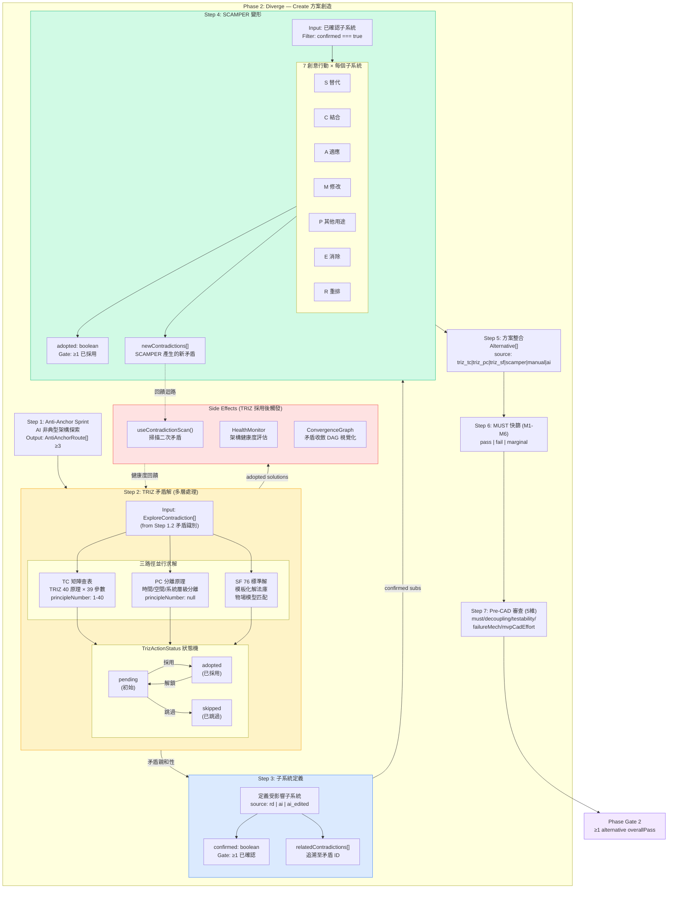
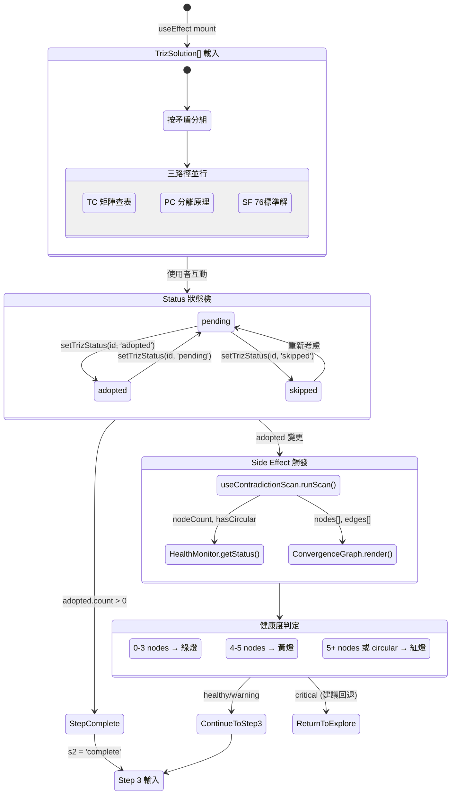
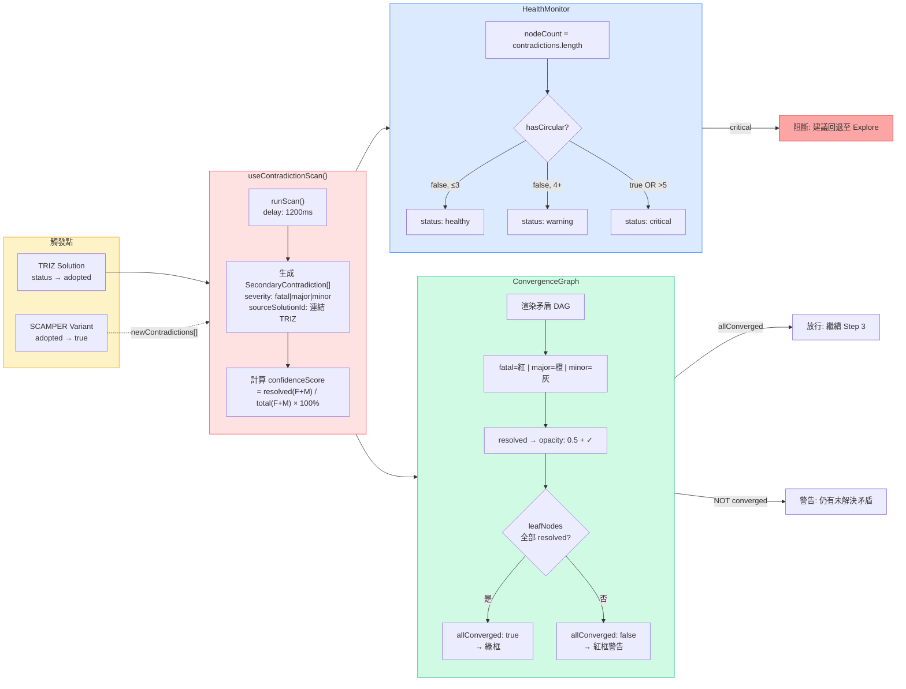
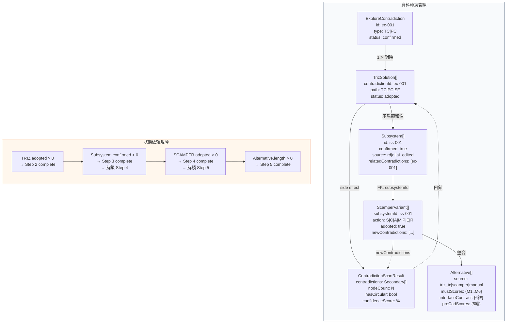
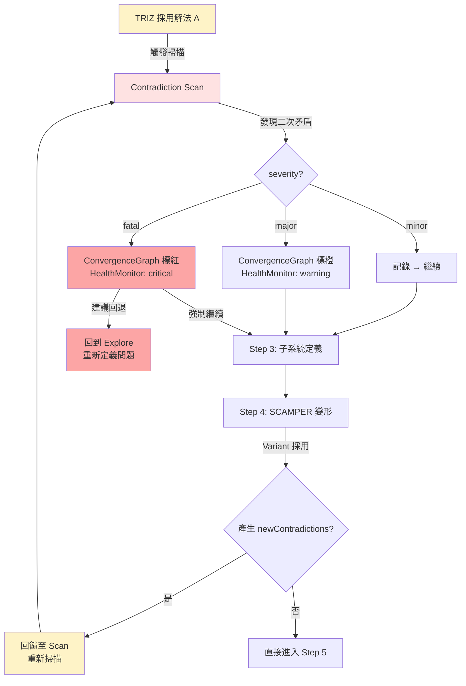

# TRIZ 矛盾解 → SCAMPER 機制：多層處理狀態與 Side Effects 流程圖

> **v2 更新 (2026-03-12)**：UI 已從線性手動模式重設計為 AI 自主收斂迴圈。
> 核心元件：`useConvergenceLoop` hook → `ConvergenceDashboard` + `BranchExplorationPanel` + `HumanReviewPanel` + `ArchitectureHaltOverlay`。
> 舊的 `useContradictionScan` (從未被呼叫) 已被取代。

## 1. 主流程總覽 (Pipeline Overview)

## 2. TRIZ 多層狀態轉換詳圖

## 3. Side Effects 詳細觸發鏈

## 4. TRIZ → Subsystem → SCAMPER 資料流向

## 5. Side Effect 回饋迴路 (Feedback Loop)

## 6. 完整狀態轉換表

| 階段 | 輸入狀態 | 處理 | 輸出狀態 | Side Effects |
|------|----------|------|----------|-------------|
| TRIZ 載入 | `ExploreContradiction[]` | 按矛盾 ID 分組，生成三路徑 | `TrizSolution[].status = 'pending'` | - |
| TRIZ 採用 | `pending` → `adopted` | 使用者點擊「採用」 | `adopted` (step complete) | `useContradictionScan()` 觸發 |
| 矛盾掃描 | `TrizSolution[adopted]` | 1200ms async scan | `SecondaryContradiction[]` | `HealthMonitor` 更新 |
| 健康評估 | `nodeCount`, `hasCircular` | 閾值判定 | `healthy\|warning\|critical` | UI 色彩變更、阻斷警告 |
| 收斂圖 | `nodes[]`, `edges[]` | DAG 繪製 + leaf 檢查 | `allConverged: bool` | 視覺化回饋 |
| 子系統定義 | TRIZ 矛盾親和性 | RD/AI 定義 + 確認 | `Subsystem[confirmed]` | 解鎖 SCAMPER |
| SCAMPER 展開 | `confirmed subsystems` | 7 行動 × N 子系統 | `ScamperVariant[adopted]` | `newContradictions[]` 回饋 |
| 新矛盾回饋 | `newContradictions[]` | 回饋至 Scan | 更新 `confidenceScore` | 迴圈重掃 |
| 方案整合 | adopted TRIZ + SCAMPER | 人工/AI 整合 | `Alternative[]` | 進入 MUST 篩選 |

## 7. 關鍵 Side Effects 清單

| # | Side Effect | 觸發條件 | 影響範圍 | 嚴重度 |
|---|------------|----------|----------|--------|
| SE-1 | 二次矛盾生成 | TRIZ solution adopted | 增加 contradictions count | 可能升級至 fatal |
| SE-2 | 架構健康度降級 | nodeCount > 3 or circular | 阻斷流程、建議回退 | critical 時阻斷 |
| SE-3 | 收斂圖未收斂 | leaf nodes 未全部 resolved | 視覺警告、confidence < 100% | Gate P 不通過 |
| SE-4 | SCAMPER 新矛盾 | variant.newContradictions[] | 回饋至 contradiction scan | 可能連鎖觸發 SE-1 |
| SE-5 | 步驟狀態連鎖更新 | 任何 adopted/confirmed 變更 | stepStatuses[] 重算 | UI accordion 狀態變更 |
| SE-6 | autoSave 觸發 | 任何資料變更 | saving → saved toast | 使用者感知 |
