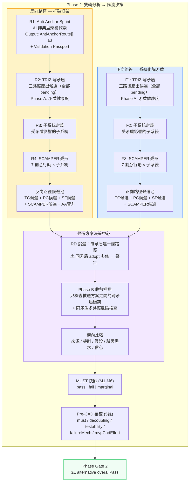
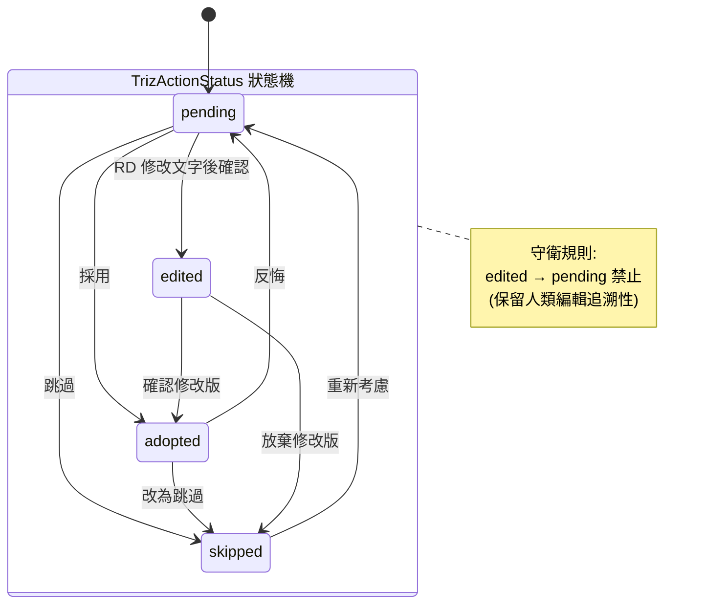
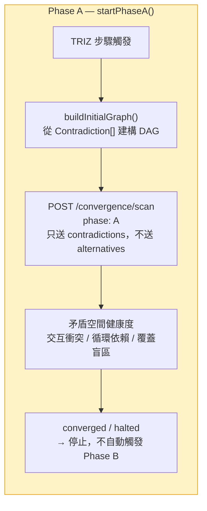
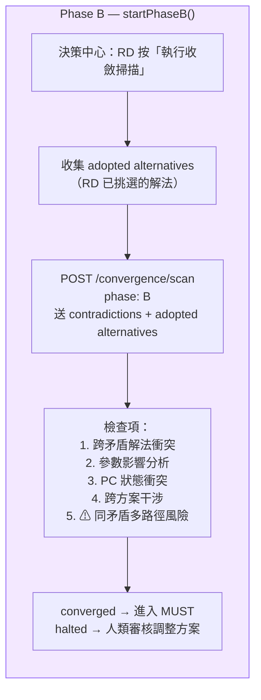
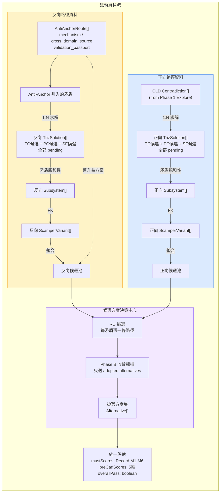
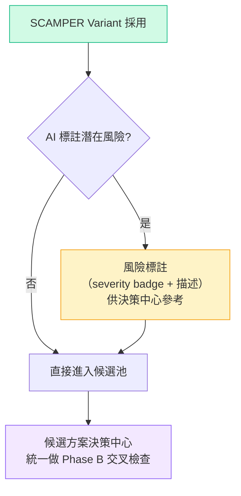

# 雙軌分析 → 候選方案決策中心：設計概念與流程圖

> **v7 (2026-03-26)**：產出與選擇分離 — TRIZ 三路徑不再同時收斂。
> - **根因修正**：v6 的收斂迴圈無限迴圈，因 TC/PC/SF 是三種不同的問題表述方式，對同一矛盾天生互斥。同時送進 Phase B 收斂掃描 = 永遠衝突。
> - **核心原則**：TRIZ 步驟只負責「產出候選」（Phase A），路徑選擇與交叉檢查（Phase B）延後到「候選方案決策中心」由 RD 挑選後才執行。
> - **Phase A**：矛盾空間健康度（不涉及解法）→ TRIZ / 子系統 / SCAMPER 步驟使用
> - **Phase B**：方案交叉檢查（只檢查被 RD 採用的解法）→ 決策中心使用
> - 新增 Phase B 檢查項：同一矛盾多路徑風險（TC+PC+SF 同時 adopt → major 風險）

---

## 0. 第一性原理：為什麼三路徑不能同時收斂

### TRIZ 三路徑的本質

| 路徑 | 問題表述 | 解法方向 |
|------|----------|----------|
| **TC** | 改善 A 會惡化 B | 40 原理打破 trade-off |
| **PC** | 同一參數需要同時是 X 和 ¬X | 時間/空間/條件分離 |
| **SF** | 物場交互不完整或有害 | 修改物質-場模型 |

**這三者不是「三個工人做同一件事」，而是「三個醫生對同一個病人提出完全不同的治療方案」。**

```
❌ 之前（v6）：
矛盾 C1 → TC解 + PC解 + SF解 → 全部送進 Phase B
→ TC解和PC解衝突 → 二次矛盾 → re-scan → 又衝突 → ∞

✅ 現在（v7）：
矛盾 C1 → TC解 + PC解 + SF解 → 全部 pending（不做 Phase B）
→ 決策中心：RD 選 C1 用 TC解
→ Phase B 只收 [C1-TC, C2-PC, C3-SF]（每矛盾一條）
→ 檢查跨矛盾衝突（合理的檢查）→ 正常收斂
```

---

## 1. 主流程總覽

**設計哲學**：Phase 2 是 **雙軌產出 → 人類選擇 → 交叉檢查 → 統一評估**。



### 設計決策說明

| 決策 | 說明 |
|------|------|
| **產出與選擇分離** | TRIZ 步驟只產出候選（Phase A），路徑選擇在決策中心（Phase B） |
| Phase A = 矛盾健康度 | TRIZ/子系統/SCAMPER 步驟呼叫 `startPhaseA()`，不涉及解法交叉 |
| Phase B = 方案交叉檢查 | 決策中心 RD 挑選後手動觸發 `startPhaseB()`，只送 adopted 解法 |
| 同矛盾多路徑警告 | Phase B prompt 新增：同一矛盾的 TC+PC+SF 同時 adopt → major 風險 |
| 無自動 A→B 轉換 | 移除 `useEffect` 自動偵測 — Phase B 完全由人類決定何時執行 |

---

## 2. TRIZ 狀態機（含轉換守衛）

**設計意圖**：每條 TRIZ 解法有獨立的生命週期。`edited` 狀態保留「人類修正 AI 建議」的追溯性，因此禁止從 `edited` 退回 `pending`。



### 合法轉換矩陣

| from ＼ to | pending | adopted | skipped | edited |
|-----------|---------|---------|---------|--------|
| **pending** | - | V | V | V |
| **adopted** | V | - | V | - |
| **skipped** | V | - | - | - |
| **edited** | **X** | V | V | - |

---

## 3. 收斂迴圈：Phase A / Phase B 分離

### Phase A：矛盾空間健康度（TRIZ 步驟使用）



### Phase B：方案交叉檢查（決策中心使用）



### 收斂判定邏輯

```
converged = iteration > 0
    AND allResolved (fatal + major 全部 resolved)
    AND (confidence >= 80 OR noNewBlocking)

halted = forcePause
    OR health = critical / circular
    OR (noNewInfo AND hasUnresolvedBlocking)
    → 觸發人類審核
```

### 人為介入點

| 動作 | 方法 | 效果 |
|------|------|------|
| 強制停止 | `forceHalt()` | 立即取消 timer + abort flag，status → halted |
| 強制繼續 | `forceContinue()` | health 降級為 warning，排程下一輪 scan |
| 重試分支 | `retryBranch(id)` | 該分支 status → exploring，排程下一輪 |
| 注入新矛盾 | `addContradiction()` | 加入 graph，若 fatal/major 自動觸發 re-scan |
| 覆寫 severity | `confirmSeverity()` | 手動修正 AI 判定的 severity |
| 重新執行 | `startPhaseA()` / `startPhaseB()` | generation counter 防舊回呼污染 |

---

## 4. 資料流向



---

## 5. SCAMPER 定位：創意發散工具（不回饋收斂迴圈）

**設計意圖**：SCAMPER 與 Anti-Anchor 同屬**創意發散工具**。潛在風險以標註方式顯示，不自動觸發 re-scan。所有產出直接進入候選方案池，在決策中心由 RD 統一評估。



**與 v6/v7 的差異**：
| | v6/v7（舊） | v8（現在） |
|---|---|---|
| newContradictions | fatal/major → 自動 addContradiction + Phase A re-scan | 顯示為風險標註，不觸發 re-scan |
| 確認流程 | 有未回饋矛盾 → 警告阻擋 | 無阻擋，所有風險在決策中心統一處理 |
| 定位 | 分析工具（產出需要收斂驗證） | **創意工具**（產出直接進池，與 Anti-Anchor 同級） |

---

## 6. 候選方案追溯六要素

每個進入決策中心的方案必須攜帶：

| # | 要素 | 欄位 | 說明 |
|---|------|------|------|
| 1 | 來源路徑 | `track: 'reverse' \| 'forward'` | 從哪條分析鏈來 |
| 2 | 來源步驟 | `source: triz_tc \| triz_pc \| triz_sf \| scamper \| anti_anchor` | 具體產出步驟 |
| 3 | 解的矛盾 | `contradiction_ids: string[]` | 追溯至原始矛盾 |
| 4 | 涉及子系統 | `subsystem_ids: string[]` | 影響範圍 |
| 5 | 基於假設 | `validation_passport.assumptions[]` | 方案成立的前提 |
| 6 | 缺少驗證 | `validation_passport.required_verifications[]` | 還需要什麼實驗 |

---

## 7. 完整狀態轉換表

| 階段 | 輸入 | 處理 | 輸出 | 連鎖效果 |
|------|------|------|------|----------|
| Anti-Anchor 生成 | mission + constraints | AI 產出非典型架構 | `AntiAnchorRoute[].length ≥ 3` | 可晉升為反向路徑方案 |
| TRIZ 產出候選 | 路徑矛盾集 | 三路徑並行生成解法 | `TrizSolution[]` 全部 `pending` | 不做 Phase B |
| Phase A 掃描 | `startPhaseA()` | 矛盾空間健康度 | converged / halted | 不觸發 Phase B |
| 子系統定義 | TRIZ 矛盾親和性 | RD/AI 定義 + 確認 | `Subsystem[confirmed]` | 解鎖 SCAMPER |
| SCAMPER 展開 | 已確認子系統 | 7 行動 × N 子系統 | `ScamperVariant[adopted]` | — |
| SCAMPER 新矛盾 | `newContradictions[]` | `addContradiction()` 注入 Phase A | fatal/major → Phase A re-scan | 路徑內閉環 |
| **決策中心選擇** | 所有候選池 | **RD 挑選每矛盾一條路徑** | adopted Alternative[] | — |
| **Phase B 掃描** | `startPhaseB()` | **跨矛盾衝突 + 同矛盾多路徑風險** | converged / halted | 人類審核 |
| MUST 篩選 | adopted Alternative + M1-M6 | AI + RD 評分 | pass / fail / marginal | 淘汰不可行方案 |
| Pre-CAD 審查 | 通過 MUST 的方案 | 五維評分 | overallPass | Phase Gate 2 判定 |

---

## 8. Health 閾值定義

| 狀態 | 條件 | UI 表現 | 流程影響 |
|------|------|---------|----------|
| `healthy` | nodeCount < 4 且無循環 | 綠燈 | 正常通行 |
| `warning` | 4 ≤ nodeCount ≤ 5 且無循環 | 黃燈 | 提示檢視，不阻斷 |
| `critical` | nodeCount > 5 | 紅燈 | 收斂迴圈 halted，建議回退 |
| `circular` | 偵測到循環矛盾依賴 | 紅燈 | 收斂迴圈 halted，需架構重構 |

---

## 9. Gate 條件

### 路徑完成 Gate（各路徑獨立）

| Gate | 條件 |
|------|------|
| 反向: R1 | routes.length ≥ 3 |
| 反向: R2 | Phase A converged 或 trizSolutions.length > 0 |
| 反向: R3 | confirmed subsystems > 0 |
| 反向: R4 | SCAMPER adopted > 0 |
| 正向: F1 | Phase A converged 或 trizSolutions.length > 0 |
| 正向: F2 | confirmed subsystems > 0 |
| 正向: F3 | SCAMPER adopted > 0 |

### 決策中心 Gate

| Gate | 條件 |
|------|------|
| 進入決策中心 | 任一路徑候選池 > 0 |
| Phase B 可執行 | ≥1 alternative adopted |
| MUST | Phase B converged + 所有候選方案 M1-M6 已評分 |
| Pre-CAD | 通過 MUST 者 5 維全評分 |
| Phase Gate 2 | ≥1 alternative overallPass |

---

## 10. 關鍵元件對照

| 元件 | 職責 | 性質 |
|------|------|------|
| `useConvergenceLoop` | 收斂迴圈 driver。`startPhaseA()` / `startPhaseB()` 分離觸發 | 狀態 hook |
| `/convergence/scan` API | Phase A: 矛盾空間分析；Phase B: 方案交叉 + 同矛盾多路徑風險 | 後端 AI |
| `ConvergenceDashboard` | 顯示 confidence %、fatal/major/minor 計數 | 純展示 |
| `BranchExplorationPanel` | 顯示各矛盾分支的探索輪次 | 純展示 |
| `HumanReviewPanel` | converged / halted 時的人類審查介面 | 純展示 |
| `ArchitectureHaltOverlay` | health critical/circular 時的 overlay | 互動 |
| `HealthMonitor` | 渲染 health 燈號 | 純展示 |
| `ConvergenceGraph` | 渲染矛盾 DAG | 純展示 |
| **Decision Hub** | 攤平所有候選、RD 路徑選擇、Phase B 觸發、橫向比較 | **核心互動區** |

---

## 11. v6 → v7 差異摘要

| 項目 | v6 | v7 |
|------|----|----|
| TRIZ 步驟收斂 | 自動 Phase A → Phase B | **只做 Phase A** |
| Phase B 觸發 | `useEffect` 自動偵測 alternatives | **決策中心手動觸發** |
| 三路徑處理 | TC/PC/SF 全部 adopt → 同時送收斂 | **全部 pending → RD 挑選 → 只送 adopted** |
| 無限迴圈風險 | 高（同矛盾多路徑天生衝突） | **消除**（每矛盾只送一條被選路徑） |
| `startExploration()` | 唯一入口 | 保留向後相容，新增 `startPhaseA()` / `startPhaseB()` |
| Phase B prompt | 4 項檢查 | **5 項**（新增同矛盾多路徑風險） |
