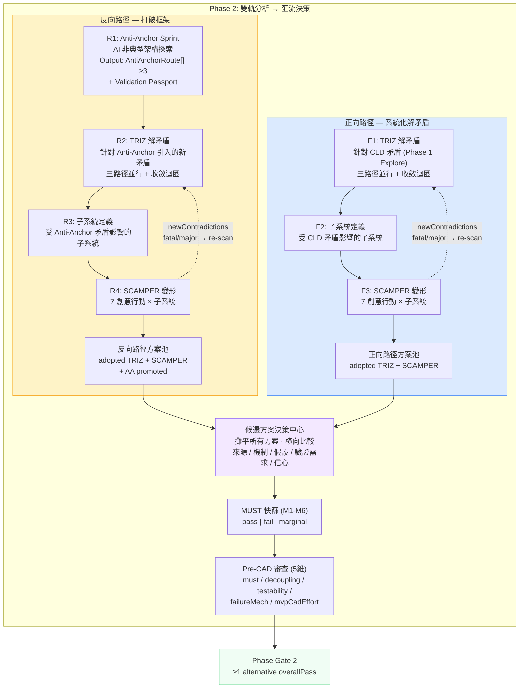
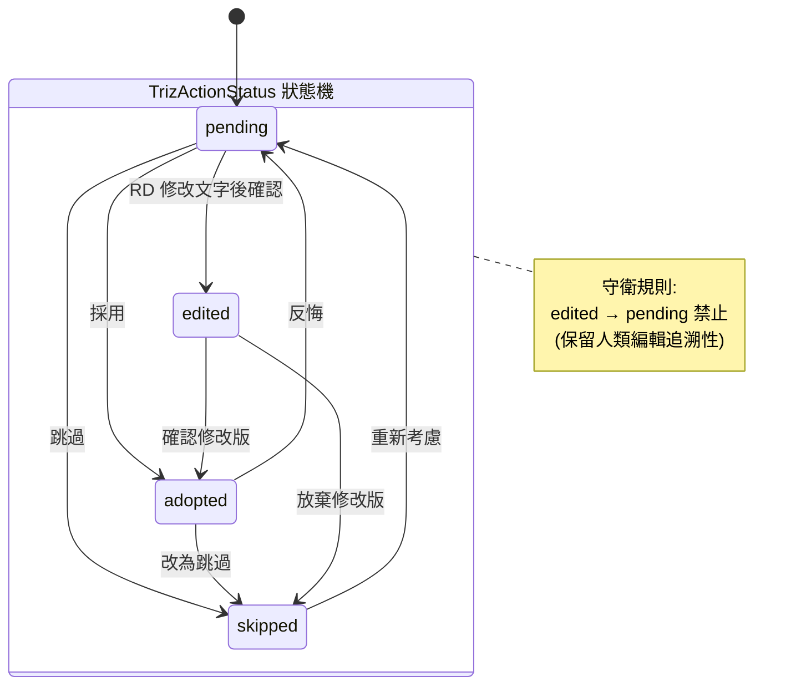
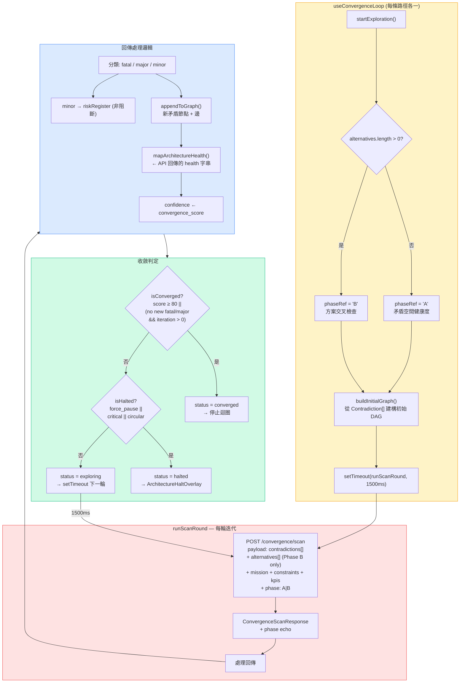
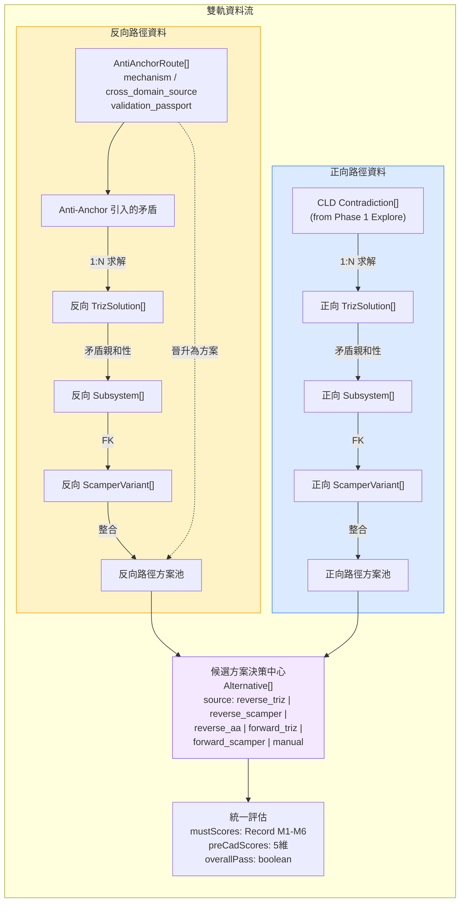
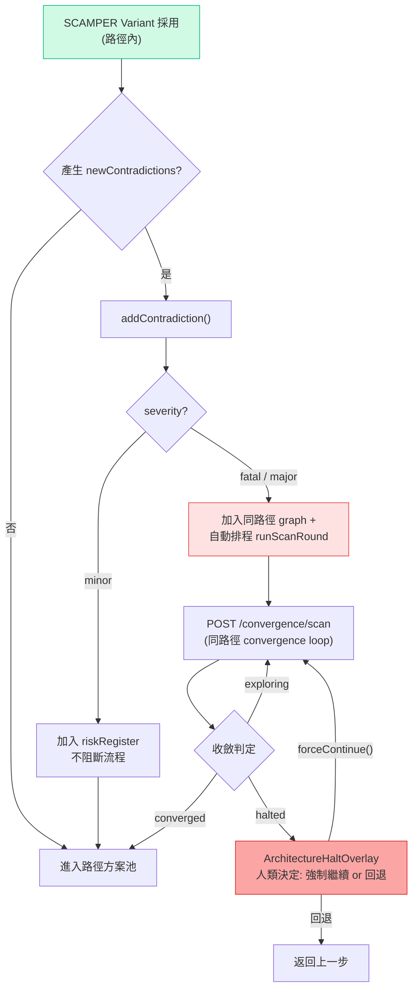

# 雙軌分析 → 候選方案決策中心：設計概念與流程圖

> **v6 (2026-03-25)**：雙軌獨立分析 + 候選方案決策中心。
> - **核心修正**：反向/正向不是「兩個入口進同一管線」，而是「兩條獨立分析鏈，結果匯流到同一張決策桌」
> - **反向路徑**各自有 Anti-Anchor → TRIZ → 子系統 → SCAMPER → 路徑方案池
> - **正向路徑**各自有 TRIZ → 子系統 → SCAMPER → 路徑方案池
> - **候選方案決策中心**：攤平所有方案做橫向比較（來源、機制、假設、驗證需求、信心）
> - Validation Passport / 收斂掃描雙階段 / SCAMPER 閉環迴饋維持不變

---

## 1. 主流程總覽

**設計哲學**：Phase 2 是 **雙軌分析 → 方案匯流 → 統一評估**。
- 兩條路徑**各自獨立**完成分析鏈
- 路徑內部各自有 TRIZ / 子系統 / SCAMPER / 收斂迴圈
- 最後在**候選方案決策中心**攤平比較
- 再進入統一評估（MUST / Pre-CAD）

### 設計決策說明

| 決策 | 說明 |
|------|------|
| 雙軌獨立 | 反向/正向各自有完整的 TRIZ → 子系統 → SCAMPER 鏈，互不干擾 |
| 路徑方案池 | 每條路徑先在內部整合自己的方案（path-local alternatives），再匯入決策中心 |
| 決策中心是主角 | 不是一個普通 step，是整個頁面的核心區塊 — 方案橫向比較 + 假設追蹤 |
| 收斂迴圈各自獨立 | 每條路徑有自己的 convergence loop 實例，各自監控各自的矛盾空間健康度 |
| SCAMPER 閉環不變 | 各路徑的 SCAMPER newContradictions 回饋至同路徑的 TRIZ 收斂迴圈 |

---

## 2. TRIZ 狀態機（含轉換守衛）

**設計意圖**：每條 TRIZ 解法有獨立的生命週期。`edited` 狀態保留「人類修正 AI 建議」的追溯性，因此禁止從 `edited` 退回 `pending`。

### 合法轉換矩陣

| from ＼ to | pending | adopted | skipped | edited |
|-----------|---------|---------|---------|--------|
| **pending** | - | V | V | V |
| **adopted** | V | - | V | - |
| **skipped** | V | - | - | - |
| **edited** | **X** | V | V | - |

---

## 3. AI 收斂迴圈詳圖（每條路徑各一實例）

**設計意圖**：每條路徑有自己的 convergence loop，各自獨立運作。Phase A/B 邏輯不變。

### 人為介入點

| 動作 | 方法 | 效果 |
|------|------|------|
| 強制停止 | `forceHalt()` | 立即取消 timer + abort flag，status → halted |
| 強制繼續 | `forceContinue()` | health 降級為 warning，排程下一輪 scan |
| 重試分支 | `retryBranch(id)` | 該分支 status → exploring，排程下一輪 |
| 注入新矛盾 | `addContradiction()` | 加入 graph，若 fatal/major 自動觸發 re-scan |
| 覆寫 severity | `confirmSeverity()` | 手動修正 AI 判定的 severity |

---

## 4. 資料流向

---

## 5. SCAMPER → 收斂迴圈回饋（每條路徑各自閉環）

**設計意圖**：SCAMPER 變形可能引入新矛盾。回饋至**同一路徑**的收斂迴圈，不跨路徑。

---

## 6. 候選方案追溯六要素

每個進入決策中心的方案必須攜帶：

| # | 要素 | 欄位 | 說明 |
|---|------|------|------|
| 1 | 來源路徑 | `track: 'reverse' \| 'forward'` | 從哪條分析鏈來 |
| 2 | 來源步驟 | `source: triz_tc \| triz_pc \| triz_sf \| scamper \| anti_anchor` | 具體產出步驟 |
| 3 | 解的矛盾 | `contradiction_ids: string[]` | 追溯至原始矛盾 |
| 4 | 涉及子系統 | `subsystem_ids: string[]` | 影響範圍 |
| 5 | 基於假設 | `validation_passport.assumptions[]` | 方案成立的前提 |
| 6 | 缺少驗證 | `validation_passport.required_verifications[]` | 還需要什麼實驗 |

---

## 7. 完整狀態轉換表

| 階段 | 輸入 | 處理 | 輸出 | 連鎖效果 |
|------|------|------|------|----------|
| Anti-Anchor 生成 | mission + constraints | AI 產出非典型架構 | `AntiAnchorRoute[].length ≥ 3` | 可晉升為反向路徑方案 |
| 路徑內 TRIZ 載入 | 路徑矛盾集 | 按矛盾 ID 分組，三路徑並行生成解法 | `TrizSolution[].status = 'pending'` | — |
| 路徑內收斂迴圈 | `startExploration()` | 自動偵測 phase + 建構 graph + 排程 scan | `status = exploring` | 各路徑獨立 |
| 路徑內子系統定義 | TRIZ 矛盾親和性 | RD/AI 定義 + 確認 | `Subsystem[confirmed]` | 解鎖 SCAMPER |
| 路徑內 SCAMPER | 已確認子系統 | 7 行動 × N 子系統 | `ScamperVariant[adopted]` | — |
| SCAMPER 新矛盾 | `newContradictions[]` | `addContradiction()` 注入同路徑收斂迴圈 | fatal/major → 自動 re-scan | 路徑內閉環 |
| 路徑方案池整合 | adopted TRIZ + SCAMPER (+ AA promoted) | 路徑內部整合 | 路徑 Alternative[] | — |
| 決策中心匯流 | 兩路徑方案池 | 攤平 + 橫向比較 | 全局 Alternative[] | 進入統一評估 |
| MUST 篩選 | Alternative + M1-M6 | AI + RD 評分 | pass / fail / marginal | 淘汰不可行方案 |
| Pre-CAD 審查 | 通過 MUST 的方案 | 五維評分 | overallPass | Phase Gate 2 判定 |

---

## 8. Health 閾值定義

| 狀態 | 條件 | UI 表現 | 流程影響 |
|------|------|---------|----------|
| `healthy` | nodeCount < 4 且無循環 | 綠燈 | 正常通行 |
| `warning` | 4 ≤ nodeCount ≤ 5 且無循環 | 黃燈 | 提示檢視，不阻斷 |
| `critical` | nodeCount > 5 | 紅燈 | 收斂迴圈 halted，建議回退 |
| `circular` | 偵測到循環矛盾依賴 | 紅燈 | 收斂迴圈 halted，需架構重構 |

---

## 9. Gate 條件

### 路徑完成 Gate（各路徑獨立）

| Gate | 條件 |
|------|------|
| 反向: R1 | routes.length ≥ 3 |
| 反向: R2 | converged 或 trizSolutions.length > 0 |
| 反向: R3 | confirmed subsystems > 0 |
| 反向: R4 | SCAMPER adopted > 0 |
| 正向: F1 | converged 或 trizSolutions.length > 0 |
| 正向: F2 | confirmed subsystems > 0 |
| 正向: F3 | SCAMPER adopted > 0 |

### 決策中心 Gate

| Gate | 條件 |
|------|------|
| 進入決策中心 | 任一路徑方案池 > 0 |
| MUST | 所有候選方案 M1-M6 已評分 |
| Pre-CAD | 通過 MUST 者 5 維全評分 |
| Phase Gate 2 | ≥1 alternative overallPass |

---

## 10. 關鍵元件對照

| 元件 | 職責 | 性質 |
|------|------|------|
| `useConvergenceLoop` | 收斂迴圈 driver（每條路徑各一實例） | 狀態 hook |
| `/convergence/scan` API | Phase A/B 矛盾分析。由 `phase` 參數切換 prompt | 後端 AI |
| `ConvergenceDashboard` | 顯示 confidence %、fatal/major/minor 計數 | 純展示 |
| `BranchExplorationPanel` | 顯示各矛盾分支的探索輪次 | 純展示 |
| `HumanReviewPanel` | 收斂完成後的人類審查介面 | 純展示 |
| `ArchitectureHaltOverlay` | halted 時的 overlay：強制繼續 or 回退 | 互動 |
| `HealthMonitor` | 渲染 health 燈號 | 純展示 |
| `ConvergenceGraph` | 渲染矛盾 DAG（可拖曳節點、severity 色彩） | 純展示 |
| **Alternative Decision Hub** | 攤平所有方案、橫向比較、假設追蹤 | **核心互動區** |
