# 正向分析・TRIZ 解矛盾：系統架構說明書（SA 視角）

> **版本**：v1.0 | **日期**：2026-04-08 | **觀點**：Systems Analyst
> **對齊依據**：`AI_Agent_Architecture.md` v1.4、`RD_Design_Copilot_整合流程.md` v1.6、`docs/diagrams/triz-to-scamper-flow.md` v10、`Forward_Subsystem_Discovery_Architecture.md` v2.0
> **文件目的**：以 SA 視角拆解「正向分析・TRIZ 解矛盾」階段（F1）的所有架構面向。F1 是正向路徑的第一站，輸入為 Step 3 識別出的矛盾，輸出為三條路徑（TC / PC / SF）的具體工程建議，供下游 F2 子系統定義消費。每張圖以 Mermaid 呈現。

---

## §0 文件導讀

| 章節 | 觀點 | 回答的問題 |
|---|---|---|
| §1 | 業務情境 | 為什麼 TRIZ 解矛盾這個階段存在？ |
| §2 | Actors & Use Cases | 誰在用？做什麼事？ |
| §3 | Context Diagram | 系統與外部世界的邊界？ |
| §4 | Container Diagram | 內部由哪些可獨立部署元件組成？ |
| §5 | Component Diagram | 三條 solver 路徑的內部切分？ |
| §6 | Data Model + 三條路徑定義 | TC / PC / SF 怎麼被定義？ |
| §7 | Sequence Diagrams | 三條路徑的執行時序？ |
| §8 | State Machine | 矛盾與建議的生命週期？ |
| §9 | 知識庫注入策略 | 如何在 LLM context window 限制下注入完整 TRIZ KB？ |
| §10 | 對下游 F2 的契約 | 給 F2 子系統定義什麼？ |
| §11 | 部署視角 | 部署單元與失敗影響？ |
| §12 | 風險、限制、迭代方向 | 已知邊界？ |

---

## §1 業務情境（Business Context）

### 1.1 問題陳述

E-bike RD 在面對「輕量 vs 強度」「散熱 vs 體積」「成本 vs 效能」這類工程矛盾時，傳統作法是憑直覺選一個折衷點，或在 CAD 階段才發現另一邊崩掉。TRIZ（俄文 Теория Решения Изобретательских Задач, Theory of Inventive Problem Solving）提供了一套形式化方法把這些矛盾抽象成 **39 個工程參數的衝突**，再用 **40 個發明原理**、**4 個分離原則**、或 **76 個標準解** 給出對應的破解方向。

但 TRIZ 知識庫有兩個落地痛點：

| 痛點 | 後果 |
|---|---|
| 知識庫太大（39 參數 + 40 原理 + 76 標準解 + 矩陣）≈ 6 萬字 | 全部塞進 LLM prompt 會超出 context 預算 |
| 三類矛盾（TC/PC/SF）的處理機制不同，但 user 往往講「我有個矛盾」就希望系統自己分流 | 沒有正確分流會用錯誤的解法路徑 |

### 1.2 系統使命

> **建立一個「規則引擎做精準查表 + LLM 做原理具體化 + 知識庫按需注入」的 TRIZ Solver，讓 RD 提出的矛盾能被自動分流到 TC / PC / SF 三條正確路徑，並產出可直接餵給 F2 子系統定義的具體工程建議。**

### 1.3 三個關鍵約束

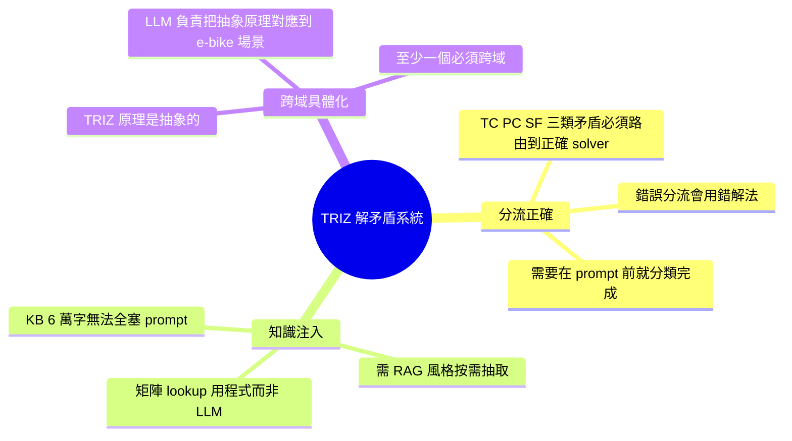
```mermaid
mindmap
  root((TRIZ 解矛盾系統))
    分流正確
      TC PC SF 三類矛盾必須路由到正確 solver
      錯誤分流會用錯解法
      需要在 prompt 前就分類完成
    知識注入
      KB 6 萬字無法全塞 prompt
      需 RAG 風格按需抽取
      矩陣 lookup 用程式而非 LLM
    跨域具體化
      TRIZ 原理是抽象的
      LLM 負責把抽象原理對應到 e-bike 場景
      至少一個必須跨域
```

---

## §2 Actors & Use Cases

### 2.1 Actor 識別

| Actor | 類型 | 與系統的關係 |
|---|---|---|
| **RD 工程師** | 主要人類 actor | 在矛盾識別頁面標記矛盾類型、檢視 TRIZ 建議、選擇採用 |
| **AI Orchestrator** | 系統內 actor | 在 E2E 流程中銜接 Step 3（矛盾識別）與 F2（子系統定義） |
| **Analyst Agent** | 系統內上游 LLM actor | 把自然語言矛盾形式化為 TC/PC/SF 並標記參數 |
| **TRIZ Solver Agent** | 系統內 LLM actor | 把抽象原理具體化為工程建議 |
| **TRIZ Knowledge Base** | 系統內靜態資源 | 39 參數 / 矩陣 / 40 原理 / 分離原則 / 76 標準解（5 份 MD） |
| **下游消費者：F2 子系統定義** | 系統內 actor | 消費 affected_modules 與 secondary_contradictions |
| **下游消費者：候選方案決策中心** | 系統內 actor | 把每條建議當成候選方案 |

### 2.2 Use Case Diagram

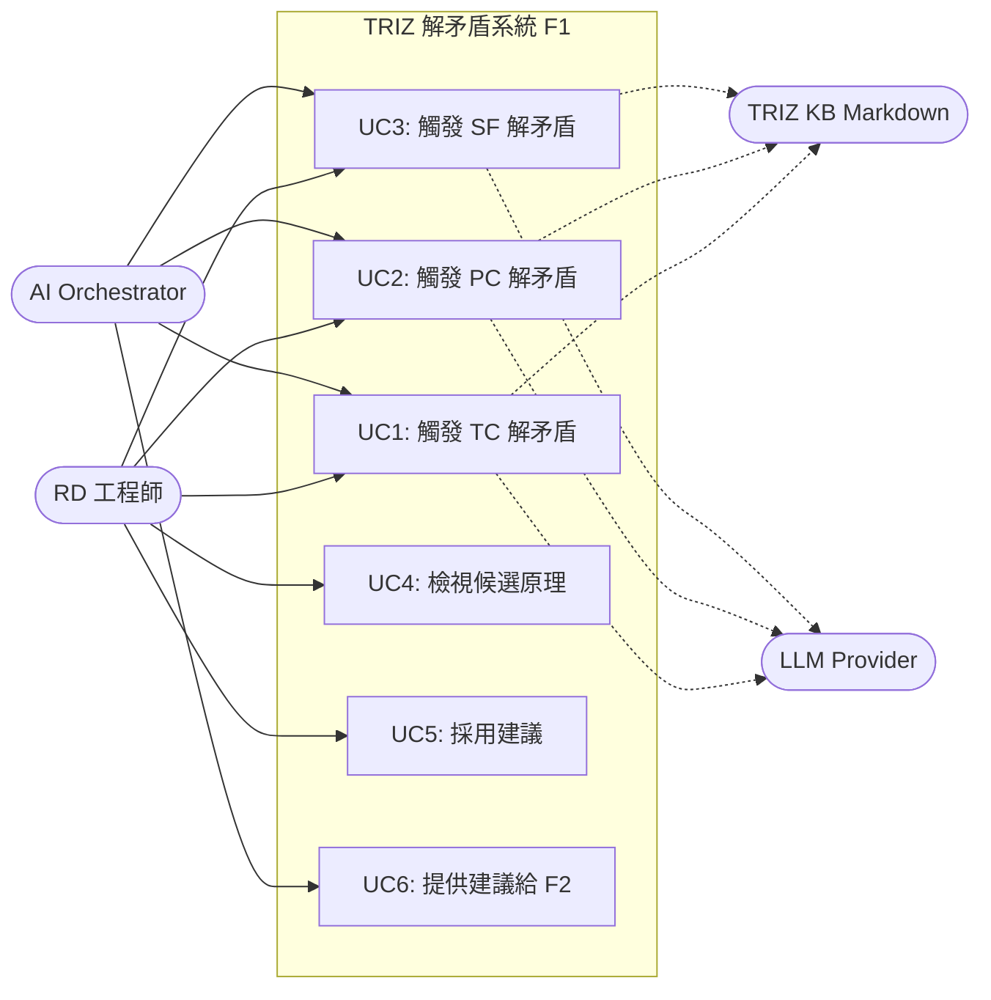
```mermaid
graph LR
    RD([RD 工程師])
    Orch([AI Orchestrator])

    subgraph SYS[TRIZ 解矛盾系統 F1]
        UC1[UC1: 觸發 TC 解矛盾]
        UC2[UC2: 觸發 PC 解矛盾]
        UC3[UC3: 觸發 SF 解矛盾]
        UC4[UC4: 檢視候選原理]
        UC5[UC5: 採用建議]
        UC6[UC6: 提供建議給 F2]
    end

    RD --> UC1
    RD --> UC2
    RD --> UC3
    RD --> UC4
    RD --> UC5
    Orch --> UC1
    Orch --> UC2
    Orch --> UC3
    Orch --> UC6

    KB([TRIZ KB Markdown])
    LLM([LLM Provider])
    UC1 -.-> KB
    UC2 -.-> KB
    UC3 -.-> KB
    UC1 -.-> LLM
    UC2 -.-> LLM
    UC3 -.-> LLM
```

### 2.3 主要 Use Case 摘要

| ID | 名稱 | 主要流程 | 成功條件 |
|---|---|---|---|
| UC1 | TC 解矛盾 | 用 (improving, worsening) 查矩陣 → 過濾候選原理 → LLM 具體化 | 至少 3 條建議，至少 1 條跨域 |
| UC2 | PC 解矛盾 | 用 separation_type 過濾原理子集 → LLM 套分離原則 | 每條建議引用物理定律 |
| UC3 | SF 解矛盾 | 從 system_state 推導相關 Class → 注入子集 → LLM 套標準解 | 每條建議標 standard_id |
| UC4 | 檢視候選原理 | RD 看 candidate_principles 與 suggestions | 視覺化顯示可指著討論 |
| UC5 | 採用建議 | RD 把某條建議標 adopted → 進入候選池 | 寫入 triz_solutions 表 |
| UC6 | 餵 F2 | F2 讀 affected_modules + secondary_contradictions | 結構化交付給子系統定義 |

---

## §3 Context Diagram（C4 Level 1）

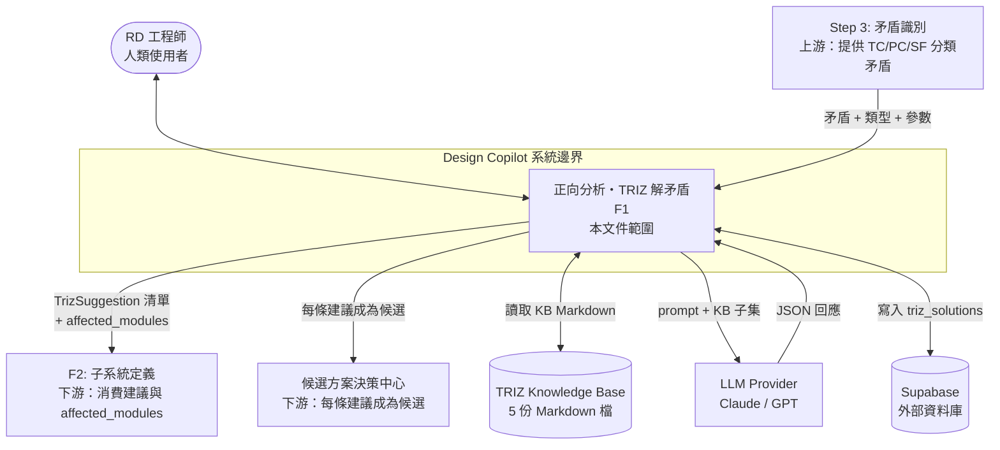
```mermaid
graph TB
    RD([RD 工程師<br/>人類使用者])

    subgraph BoundedContext[Design Copilot 系統邊界]
        F1[正向分析・TRIZ 解矛盾<br/>F1<br/>本文件範圍]
    end

    Step3[Step 3: 矛盾識別<br/>上游：提供 TC/PC/SF 分類矛盾]
    F2[F2: 子系統定義<br/>下游：消費建議與 affected_modules]
    Hub[候選方案決策中心<br/>下游：每條建議成為候選]

    KB[(TRIZ Knowledge Base<br/>5 份 Markdown 檔)]
    LLM[LLM Provider<br/>Claude / GPT]
    Supabase[(Supabase<br/>外部資料庫)]

    RD <--> F1
    Step3 -->|矛盾 + 類型 + 參數| F1
    F1 -->|TrizSuggestion 清單<br/>+ affected_modules| F2
    F1 -->|每條建議成為候選| Hub
    F1 <-->|讀取 KB Markdown| KB
    F1 -->|prompt + KB 子集| LLM
    LLM -->|JSON 回應| F1
    F1 <-->|寫入 triz_solutions| Supabase
```

---

## §4 Container Diagram（C4 Level 2）

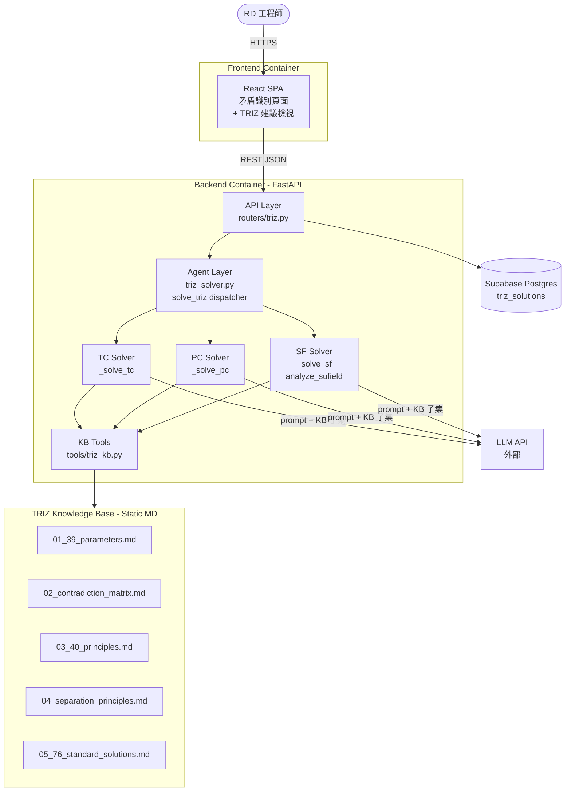
```mermaid
graph TB
    RD([RD 工程師])

    subgraph Frontend[Frontend Container]
        FE[React SPA<br/>矛盾識別頁面<br/>+ TRIZ 建議檢視]
    end

    subgraph Backend[Backend Container - FastAPI]
        API[API Layer<br/>routers/triz.py]
        AGENT[Agent Layer<br/>triz_solver.py<br/>solve_triz dispatcher]
        TC[TC Solver<br/>_solve_tc]
        PC[PC Solver<br/>_solve_pc]
        SF[SF Solver<br/>_solve_sf<br/>analyze_sufield]
        TOOLS[KB Tools<br/>tools/triz_kb.py]
    end

    subgraph KB[TRIZ Knowledge Base - Static MD]
        K1[01_39_parameters.md]
        K2[02_contradiction_matrix.md]
        K3[03_40_principles.md]
        K4[04_separation_principles.md]
        K5[05_76_standard_solutions.md]
    end

    LLM[LLM API<br/>外部]
    DB[(Supabase Postgres<br/>triz_solutions)]

    RD -->|HTTPS| FE
    FE -->|REST JSON| API
    API --> AGENT
    AGENT --> TC
    AGENT --> PC
    AGENT --> SF
    TC --> TOOLS
    PC --> TOOLS
    SF --> TOOLS
    TOOLS --> KB
    TC -->|prompt + KB 子集| LLM
    PC -->|prompt + KB 子集| LLM
    SF -->|prompt + KB 子集| LLM
    API --> DB
```

### 4.1 Container 職責表

| Container | 技術棧 | 失敗時影響 | 恢復策略 |
|---|---|---|---|
| Frontend SPA | React + TypeScript | RD 無法觸發；後端不受影響 | 無狀態，重啟即可 |
| Backend API/Agent | FastAPI + Python | F1 全面停擺；Step 3 與 F2 不受影響 | 無狀態，可水平擴展 |
| KB Tools | Python + lru_cache | 無法注入 KB；solver 退化為純 LLM 直答 | 啟動時即載入並快取 |
| TRIZ KB MD | 靜態檔案 | 同上 | 隨 Backend image 部署 |
| LLM Provider | 外部 API | 三條 solver 全部無法跑 | 重試 + 降級提示 |
| Supabase | Postgres | 無法持久化建議，但 in-memory 結果仍可回 | 連線重試 |

---

## §5 Component Diagram（C4 Level 3）

聚焦在 Backend Container 內部的職責切分：

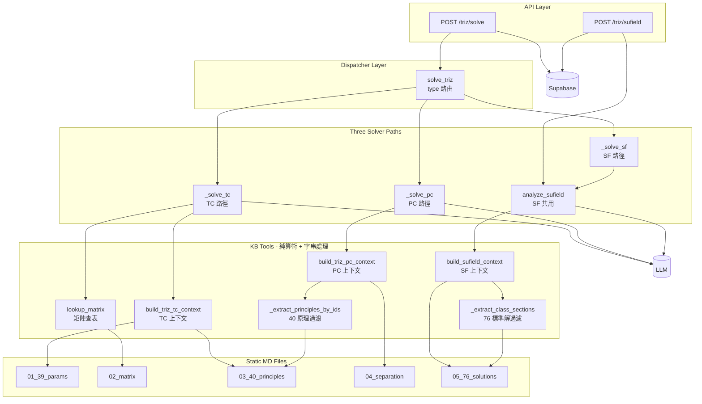
```mermaid
graph TB
    subgraph API[API Layer]
        R1[POST /triz/solve]
        R2[POST /triz/sufield]
    end

    subgraph Dispatcher[Dispatcher Layer]
        SOLVE[solve_triz<br/>type 路由]
    end

    subgraph Solvers[Three Solver Paths]
        TC[_solve_tc<br/>TC 路徑]
        PC[_solve_pc<br/>PC 路徑]
        SF[_solve_sf<br/>SF 路徑]
        SFA[analyze_sufield<br/>SF 共用]
    end

    subgraph KBT[KB Tools - 純算術 + 字串處理]
        LM[lookup_matrix<br/>矩陣查表]
        BTC[build_triz_tc_context<br/>TC 上下文]
        BPC[build_triz_pc_context<br/>PC 上下文]
        BSF[build_sufield_context<br/>SF 上下文]
        EX1[_extract_class_sections<br/>76 標準解過濾]
        EX2[_extract_principles_by_ids<br/>40 原理過濾]
    end

    subgraph KB[Static MD Files]
        F1[01_39_params]
        F2[02_matrix]
        F3[03_40_principles]
        F4[04_separation]
        F5[05_76_solutions]
    end

    LLM[(LLM)]
    DB[(Supabase)]

    R1 --> SOLVE
    R2 --> SFA
    SOLVE --> TC
    SOLVE --> PC
    SOLVE --> SF
    SF --> SFA

    TC --> LM
    TC --> BTC
    PC --> BPC
    SFA --> BSF

    BTC --> F1
    BTC --> F3
    LM --> F2
    BPC --> F4
    BPC --> EX2
    EX2 --> F3
    BSF --> F5
    BSF --> EX1
    EX1 --> F5

    TC --> LLM
    PC --> LLM
    SFA --> LLM

    R1 --> DB
    R2 --> DB
```

### 5.1 Component 職責表

| Component | 純度 | 是否呼叫 LLM | 是否可獨立測試 |
|---|---|---|---|
| `solve_triz` (dispatcher) | 純路由 | ❌ | ✅ |
| `_solve_tc` | 編排 | ✅ | 需 mock LLM |
| `_solve_pc` | 編排 | ✅ | 需 mock LLM |
| `_solve_sf` | 編排 | ✅ | 需 mock LLM |
| `lookup_matrix` | 純函式 | ❌ | ✅ |
| `build_triz_tc_context` | 純字串 | ❌ | ✅ |
| `build_triz_pc_context` | 純字串 | ❌ | ✅ |
| `build_sufield_context` | 純字串 | ❌ | ✅ |
| `_extract_class_sections` | 純 regex | ❌ | ✅ |
| `_extract_principles_by_ids` | 純 regex | ❌ | ✅ |

> **設計原則**：除了三條 `_solve_*` 必須呼叫 LLM，其他所有 component 都是 pure function 並用 `lru_cache` 快取，可在沒有外部依賴下單元測試。**矩陣查表用程式而非 LLM**——這是 TRIZ 規則引擎落地的關鍵。

---

## §6 資料模型與三條路徑的定義來源

### 6.1 核心實體關係

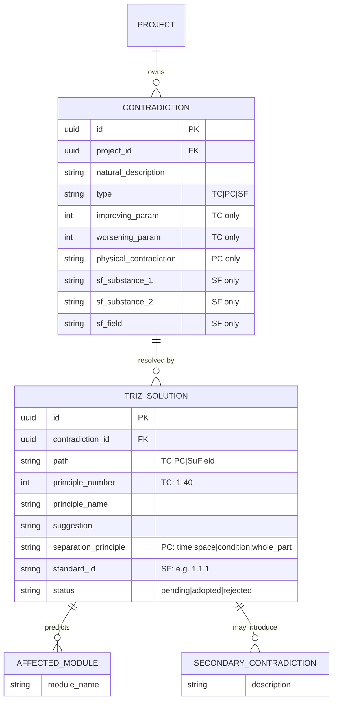
```mermaid
erDiagram
    PROJECT ||--o{ CONTRADICTION : owns
    CONTRADICTION ||--o{ TRIZ_SOLUTION : "resolved by"
    TRIZ_SOLUTION ||--o{ AFFECTED_MODULE : "predicts"
    TRIZ_SOLUTION ||--o{ SECONDARY_CONTRADICTION : "may introduce"

    CONTRADICTION {
        uuid id PK
        uuid project_id FK
        string natural_description
        string type "TC|PC|SF"
        int improving_param "TC only"
        int worsening_param "TC only"
        string physical_contradiction "PC only"
        string sf_substance_1 "SF only"
        string sf_substance_2 "SF only"
        string sf_field "SF only"
    }
    TRIZ_SOLUTION {
        uuid id PK
        uuid contradiction_id FK
        string path "TC|PC|SuField"
        int principle_number "TC: 1-40"
        string principle_name
        string suggestion
        string separation_principle "PC: time|space|condition|whole_part"
        string standard_id "SF: e.g. 1.1.1"
        string status "pending|adopted|rejected"
    }
    AFFECTED_MODULE {
        string module_name
    }
    SECONDARY_CONTRADICTION {
        string description
    }
```

### 6.2 三類矛盾的定義（TC / PC / SF）

TRIZ 把矛盾分成三類，每類有不同的形式化結構與解法路徑。**這個分類不是任意的——它對應「問題在物理上呈現的方式」**。

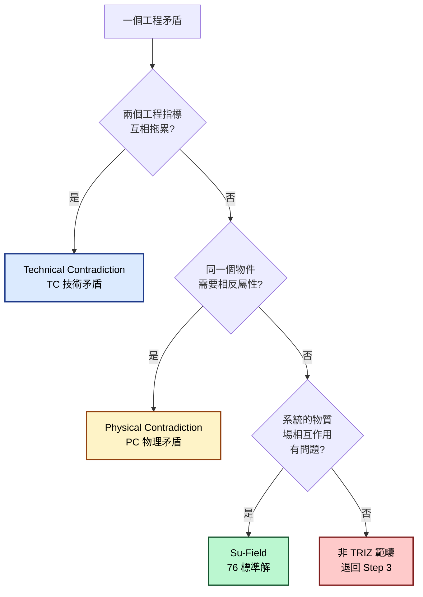
```mermaid
graph TB
    M[一個工程矛盾]

    M --> Q1{兩個工程指標<br/>互相拖累?}
    Q1 -->|是| TC[Technical Contradiction<br/>TC 技術矛盾]
    Q1 -->|否| Q2{同一個物件<br/>需要相反屬性?}
    Q2 -->|是| PC[Physical Contradiction<br/>PC 物理矛盾]
    Q2 -->|否| Q3{系統的物質<br/>場相互作用<br/>有問題?}
    Q3 -->|是| SF[Su-Field<br/>76 標準解]
    Q3 -->|否| REJ[非 TRIZ 範疇<br/>退回 Step 3]

    style TC fill:#dbeafe,stroke:#1e3a8a,stroke-width:2px,color:#000
    style PC fill:#fef3c7,stroke:#92400e,stroke-width:2px,color:#000
    style SF fill:#bbf7d0,stroke:#14532d,stroke-width:2px,color:#000
    style REJ fill:#fecaca,stroke:#7f1d1d,stroke-width:2px,color:#000
```

### 6.3 TC 路徑的定義來源

**結構**：兩個 TRIZ 39 工程參數的衝突，一個要改善、一個會惡化。

**範例**：
- 改善：#1 移動物件的重量（馬達輕量化）
- 惡化：#14 強度（馬達散熱片變薄會降低結構強度）

**解法來源**：TRIZ 矛盾矩陣 39×39，每格列出 1-4 個推薦原理（共 40 個發明原理）。

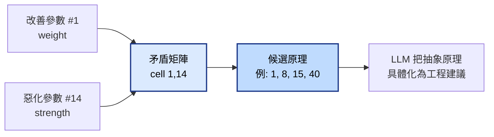
```mermaid
graph LR
    Imp[改善參數 #1<br/>weight] --> M
    Wor[惡化參數 #14<br/>strength] --> M
    M[矛盾矩陣<br/>cell 1,14] --> P[候選原理<br/>例: 1, 8, 15, 40]
    P --> LLM[LLM 把抽象原理<br/>具體化為工程建議]

    style M fill:#dbeafe,stroke:#1e3a8a,stroke-width:2px,color:#000
    style P fill:#bfdbfe,stroke:#1e3a8a,stroke-width:2px,color:#000
```

**定義來源**：`backend/triz_knowledge_base/02_contradiction_matrix.md`（39×39 表格）+ `01_39_parameters.md`（參數定義）+ `03_40_principles.md`（原理詳細）。

### 6.4 PC 路徑的定義來源

**結構**：同一個物件需要互斥的物理屬性。

**範例**：
- 矛盾：齒輪要硬（耐磨）但又要軟（吸震）
- PC 描述：「同一個齒輪表面，在接觸瞬間需要硬，在受衝擊時需要軟」

**解法來源**：4 個分離原則，每個對應一組 40 原理的子集。

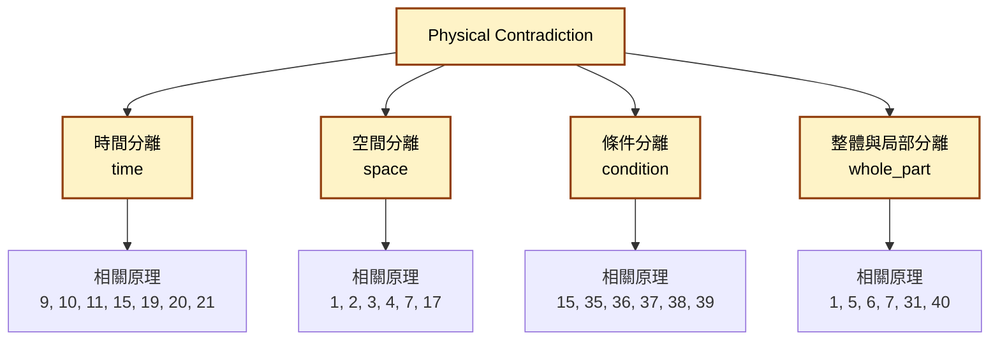
```mermaid
graph TB
    PC[Physical Contradiction]

    PC --> S1[時間分離<br/>time]
    PC --> S2[空間分離<br/>space]
    PC --> S3[條件分離<br/>condition]
    PC --> S4[整體與局部分離<br/>whole_part]

    S1 --> P1[相關原理<br/>9, 10, 11, 15, 19, 20, 21]
    S2 --> P2[相關原理<br/>1, 2, 3, 4, 7, 17]
    S3 --> P3[相關原理<br/>15, 35, 36, 37, 38, 39]
    S4 --> P4[相關原理<br/>1, 5, 6, 7, 31, 40]

    style PC fill:#fef3c7,stroke:#92400e,stroke-width:2px,color:#000
    style S1 fill:#fef3c7,stroke:#92400e,stroke-width:2px,color:#000
    style S2 fill:#fef3c7,stroke:#92400e,stroke-width:2px,color:#000
    style S3 fill:#fef3c7,stroke:#92400e,stroke-width:2px,color:#000
    style S4 fill:#fef3c7,stroke:#92400e,stroke-width:2px,color:#000
```

**定義來源**：`backend/triz_knowledge_base/04_separation_principles.md`（4 個分離原則的策略） + `03_40_principles.md` 的子集。每個分離原則對應的子集寫死在 `tools/triz_kb.py` 的 `_SEPARATION_RELEVANT_PRINCIPLES` dict。

### 6.5 SF 路徑的定義來源

**結構**：Su-Field 模型把系統抽象為「物質 1（S1）+ 物質 2（S2）+ 場（F）」三元組。

**範例**：
- S1：散熱片（Object）
- S2：MOSFET（Tool）
- F：熱場（Thermal field, Fourier heat conduction）
- 系統狀態：insufficient（散熱量不夠）

**解法來源**：76 個標準解，依系統狀態映射到對應 Class。

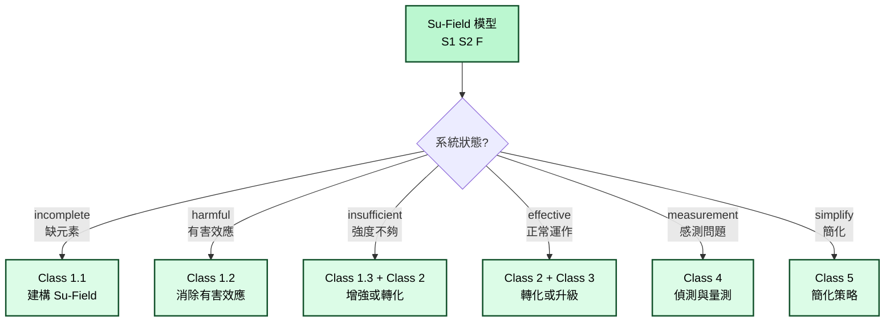
```mermaid
graph TB
    SF[Su-Field 模型<br/>S1 S2 F]

    SF --> ST{系統狀態?}
    ST -->|incomplete<br/>缺元素| C1[Class 1.1<br/>建構 Su-Field]
    ST -->|harmful<br/>有害效應| C12[Class 1.2<br/>消除有害效應]
    ST -->|insufficient<br/>強度不夠| C13[Class 1.3 + Class 2<br/>增強或轉化]
    ST -->|effective<br/>正常運作| C23[Class 2 + Class 3<br/>轉化或升級]
    ST -->|measurement<br/>感測問題| C4[Class 4<br/>偵測與量測]
    ST -->|simplify<br/>簡化| C5[Class 5<br/>簡化策略]

    style SF fill:#bbf7d0,stroke:#14532d,stroke-width:2px,color:#000
    style C1 fill:#dcfce7,stroke:#14532d,stroke-width:2px,color:#000
    style C12 fill:#dcfce7,stroke:#14532d,stroke-width:2px,color:#000
    style C13 fill:#dcfce7,stroke:#14532d,stroke-width:2px,color:#000
    style C23 fill:#dcfce7,stroke:#14532d,stroke-width:2px,color:#000
    style C4 fill:#dcfce7,stroke:#14532d,stroke-width:2px,color:#000
    style C5 fill:#dcfce7,stroke:#14532d,stroke-width:2px,color:#000
```

**定義來源**：`backend/triz_knowledge_base/05_76_standard_solutions.md`（76 標準解依 Class 1-5 分類）。系統狀態到 Class 的映射寫死在 `tools/triz_kb.py` 的 `_SUFIELD_STATE_TO_CLASSES` dict。

### 6.6 為什麼是這三條路徑（不是兩條也不是四條）

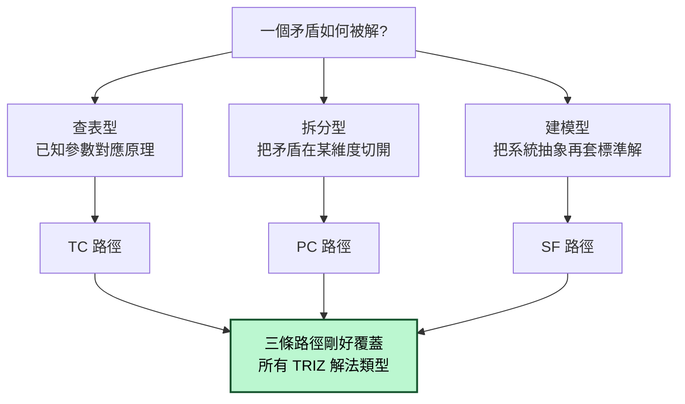
```mermaid
graph TB
    Q[一個矛盾如何被解?]

    Q --> A1[查表型<br/>已知參數對應原理]
    Q --> A2[拆分型<br/>把矛盾在某維度切開]
    Q --> A3[建模型<br/>把系統抽象再套標準解]

    A1 --> TC2[TC 路徑]
    A2 --> PC2[PC 路徑]
    A3 --> SF2[SF 路徑]

    TC2 --> R[三條路徑剛好覆蓋<br/>所有 TRIZ 解法類型]
    PC2 --> R
    SF2 --> R

    style R fill:#bbf7d0,stroke:#14532d,stroke-width:2px,color:#000
```

- **不能合併**：三條路徑的形式化結構完全不同（TC 用兩參數、PC 用矛盾陳述、SF 用三元組），共用 prompt 會丟失精度
- **不需要新增**：TRIZ 經典理論共有這三大解法系統，多出來的工具（如 ARIZ、Trends of Evolution）都是這三條路徑的組合

---

## §7 Sequence Diagrams

### 7.1 主分流：solve_triz dispatcher

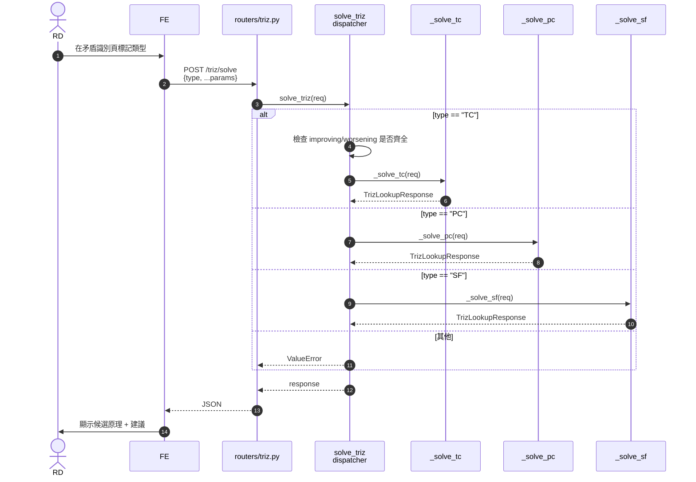
```mermaid
sequenceDiagram
    autonumber
    actor RD
    participant FE
    participant API as routers/triz.py
    participant DSP as solve_triz<br/>dispatcher
    participant TC as _solve_tc
    participant PC as _solve_pc
    participant SF as _solve_sf

    RD->>FE: 在矛盾識別頁標記類型
    FE->>API: POST /triz/solve<br/>{type, ...params}
    API->>DSP: solve_triz(req)

    alt type == "TC"
        DSP->>DSP: 檢查 improving/worsening 是否齊全
        DSP->>TC: _solve_tc(req)
        TC-->>DSP: TrizLookupResponse
    else type == "PC"
        DSP->>PC: _solve_pc(req)
        PC-->>DSP: TrizLookupResponse
    else type == "SF"
        DSP->>SF: _solve_sf(req)
        SF-->>DSP: TrizLookupResponse
    else 其他
        DSP-->>API: ValueError
    end

    DSP-->>API: response
    API-->>FE: JSON
    FE->>RD: 顯示候選原理 + 建議
```

### 7.2 UC1：TC 路徑詳細時序

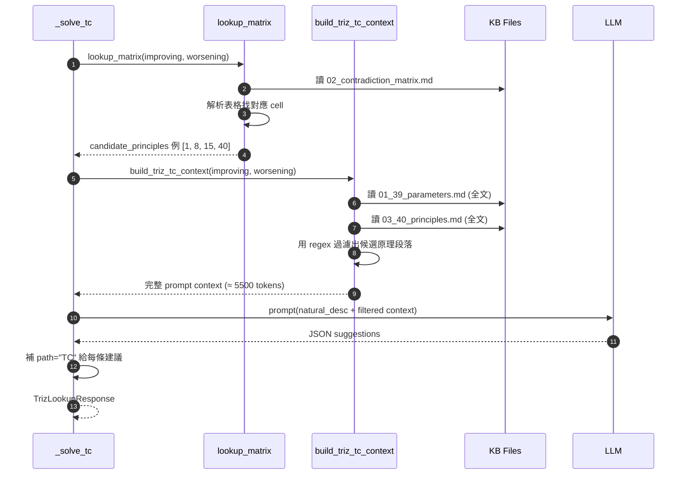
```mermaid
sequenceDiagram
    autonumber
    participant TC as _solve_tc
    participant LM as lookup_matrix
    participant BTC as build_triz_tc_context
    participant KB as KB Files
    participant LLM

    TC->>LM: lookup_matrix(improving, worsening)
    LM->>KB: 讀 02_contradiction_matrix.md
    LM->>LM: 解析表格找對應 cell
    LM-->>TC: candidate_principles 例 [1, 8, 15, 40]

    TC->>BTC: build_triz_tc_context(improving, worsening)
    BTC->>KB: 讀 01_39_parameters.md (全文)
    BTC->>KB: 讀 03_40_principles.md (全文)
    BTC->>BTC: 用 regex 過濾出候選原理段落
    BTC-->>TC: 完整 prompt context (≈ 5500 tokens)

    TC->>LLM: prompt(natural_desc + filtered context)
    LLM-->>TC: JSON suggestions

    TC->>TC: 補 path="TC" 給每條建議
    TC-->>TC: TrizLookupResponse
```

### 7.3 UC2：PC 路徑詳細時序

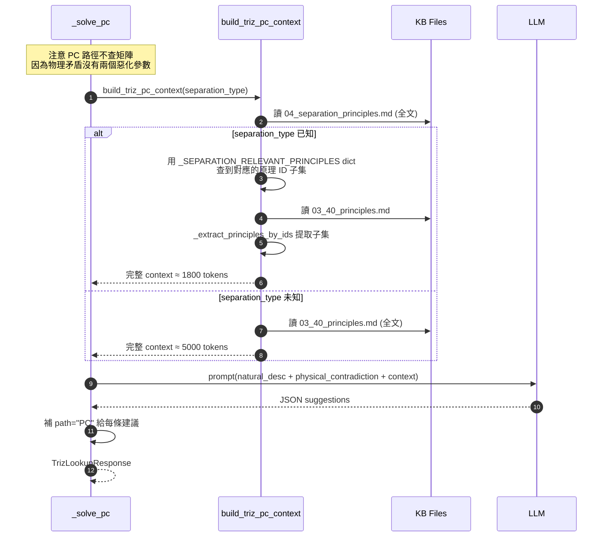
```mermaid
sequenceDiagram
    autonumber
    participant PC as _solve_pc
    participant BPC as build_triz_pc_context
    participant KB as KB Files
    participant LLM

    Note over PC: 注意 PC 路徑不查矩陣<br/>因為物理矛盾沒有兩個惡化參數

    PC->>BPC: build_triz_pc_context(separation_type)
    BPC->>KB: 讀 04_separation_principles.md (全文)

    alt separation_type 已知
        BPC->>BPC: 用 _SEPARATION_RELEVANT_PRINCIPLES dict<br/>查到對應的原理 ID 子集
        BPC->>KB: 讀 03_40_principles.md
        BPC->>BPC: _extract_principles_by_ids 提取子集
        BPC-->>PC: 完整 context ≈ 1800 tokens
    else separation_type 未知
        BPC->>KB: 讀 03_40_principles.md (全文)
        BPC-->>PC: 完整 context ≈ 5000 tokens
    end

    PC->>LLM: prompt(natural_desc + physical_contradiction + context)
    LLM-->>PC: JSON suggestions
    PC->>PC: 補 path="PC" 給每條建議
    PC-->>PC: TrizLookupResponse
```

### 7.4 UC3：SF 路徑詳細時序

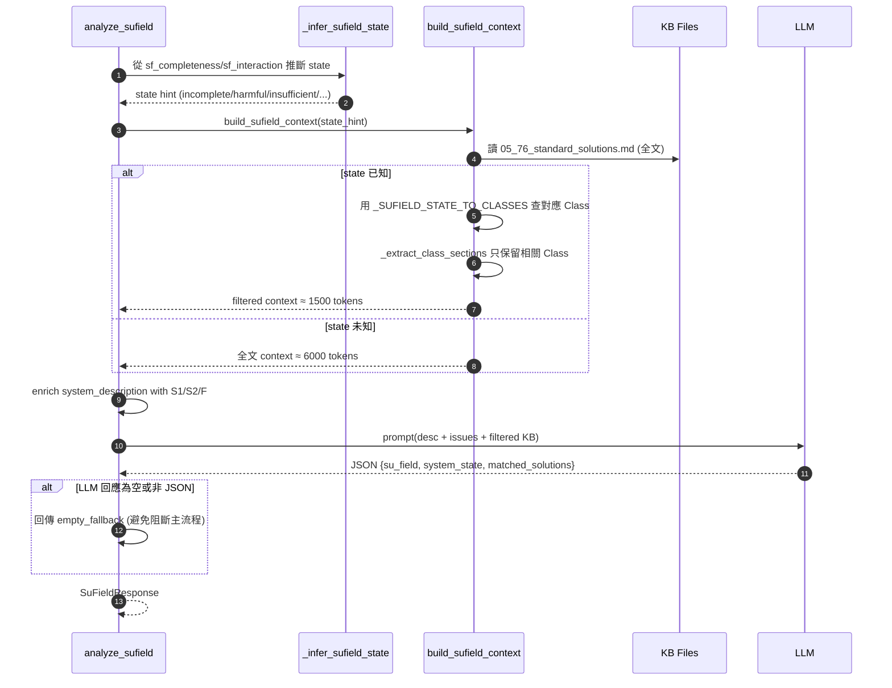
```mermaid
sequenceDiagram
    autonumber
    participant SF as analyze_sufield
    participant INF as _infer_sufield_state
    participant BSF as build_sufield_context
    participant KB as KB Files
    participant LLM

    SF->>INF: 從 sf_completeness/sf_interaction 推斷 state
    INF-->>SF: state hint (incomplete/harmful/insufficient/...)

    SF->>BSF: build_sufield_context(state_hint)
    BSF->>KB: 讀 05_76_standard_solutions.md (全文)

    alt state 已知
        BSF->>BSF: 用 _SUFIELD_STATE_TO_CLASSES 查對應 Class
        BSF->>BSF: _extract_class_sections 只保留相關 Class
        BSF-->>SF: filtered context ≈ 1500 tokens
    else state 未知
        BSF-->>SF: 全文 context ≈ 6000 tokens
    end

    SF->>SF: enrich system_description with S1/S2/F
    SF->>LLM: prompt(desc + issues + filtered KB)
    LLM-->>SF: JSON {su_field, system_state, matched_solutions}

    alt LLM 回應為空或非 JSON
        SF->>SF: 回傳 empty_fallback (避免阻斷主流程)
    end

    SF-->>SF: SuFieldResponse
```

### 7.5 三條路徑的差異總覽

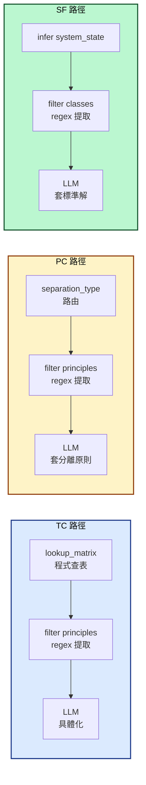
```mermaid
graph LR
    subgraph TCPath[TC 路徑]
        TC1[lookup_matrix<br/>程式查表] --> TC2[filter principles<br/>regex 提取] --> TC3[LLM<br/>具體化]
    end

    subgraph PCPath[PC 路徑]
        PC1[separation_type<br/>路由] --> PC2[filter principles<br/>regex 提取] --> PC3[LLM<br/>套分離原則]
    end

    subgraph SFPath[SF 路徑]
        SF1[infer system_state] --> SF2[filter classes<br/>regex 提取] --> SF3[LLM<br/>套標準解]
    end

    style TCPath fill:#dbeafe,stroke:#1e3a8a,stroke-width:2px,color:#000
    style PCPath fill:#fef3c7,stroke:#92400e,stroke-width:2px,color:#000
    style SFPath fill:#bbf7d0,stroke:#14532d,stroke-width:2px,color:#000
```

---

## §8 State Machine

### 8.1 矛盾的生命週期

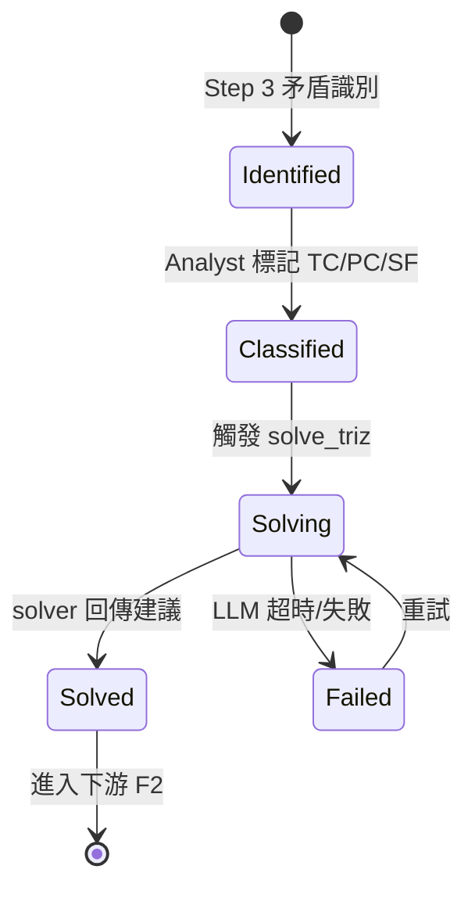
```mermaid
stateDiagram-v2
    [*] --> Identified: Step 3 矛盾識別
    Identified --> Classified: Analyst 標記 TC/PC/SF
    Classified --> Solving: 觸發 solve_triz
    Solving --> Solved: solver 回傳建議
    Solving --> Failed: LLM 超時/失敗
    Failed --> Solving: 重試
    Solved --> [*]: 進入下游 F2
```

### 8.2 TrizSuggestion 狀態流轉

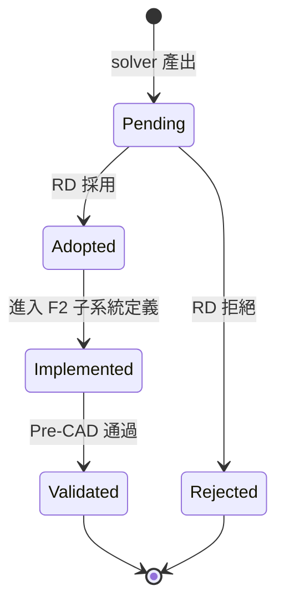
```mermaid
stateDiagram-v2
    [*] --> Pending: solver 產出
    Pending --> Adopted: RD 採用
    Pending --> Rejected: RD 拒絕
    Adopted --> Implemented: 進入 F2 子系統定義
    Implemented --> Validated: Pre-CAD 通過
    Validated --> [*]
    Rejected --> [*]
```

### 8.3 三類矛盾路由的決策狀態

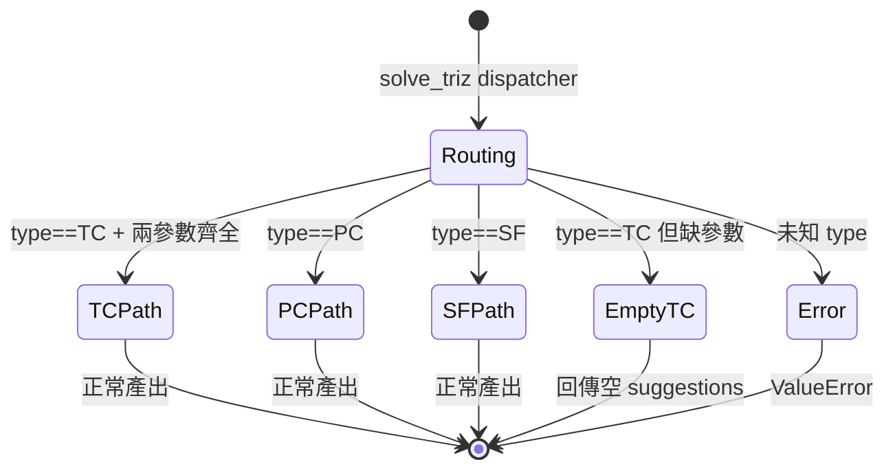
```mermaid
stateDiagram-v2
    [*] --> Routing: solve_triz dispatcher
    Routing --> TCPath: type==TC + 兩參數齊全
    Routing --> EmptyTC: type==TC 但缺參數
    Routing --> PCPath: type==PC
    Routing --> SFPath: type==SF
    Routing --> Error: 未知 type

    TCPath --> [*]: 正常產出
    PCPath --> [*]: 正常產出
    SFPath --> [*]: 正常產出
    EmptyTC --> [*]: 回傳空 suggestions
    Error --> [*]: ValueError
```

---

## §9 知識庫注入策略

TRIZ 知識庫總大小約 6 萬字（39 參數 + 矩陣 + 40 原理 + 分離原則 + 76 標準解），全部塞進 prompt 會用掉 LLM 大半 context window。系統採用 **「規則引擎做精準提取 + 子集注入」** 的策略，讓每條 solver 只注入它真正需要的部分。

### 9.1 三條路徑的注入大小對比

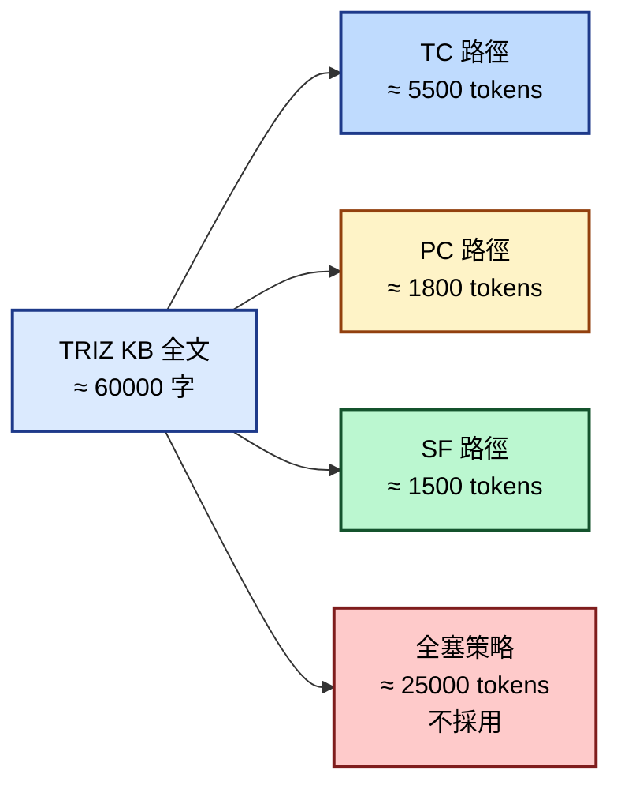
```mermaid
flowchart LR
    KB[TRIZ KB 全文<br/>≈ 60000 字] --> TC[TC 路徑<br/>≈ 5500 tokens]
    KB --> PC[PC 路徑<br/>≈ 1800 tokens]
    KB --> SF[SF 路徑<br/>≈ 1500 tokens]
    KB --> Bad[全塞策略<br/>≈ 25000 tokens<br/>不採用]

    style KB fill:#dbeafe,stroke:#1e3a8a,stroke-width:2px,color:#000
    style TC fill:#bfdbfe,stroke:#1e3a8a,stroke-width:2px,color:#000
    style PC fill:#fef3c7,stroke:#92400e,stroke-width:2px,color:#000
    style SF fill:#bbf7d0,stroke:#14532d,stroke-width:2px,color:#000
    style Bad fill:#fecaca,stroke:#7f1d1d,stroke-width:2px,color:#000
```

### 9.2 注入策略的三層篩選

```mermaid
flowchart TB
    Q[Solver 請求] --> L1[Layer 1: Path 路由<br/>TC/PC/SF 分開處理]
    L1 --> L2[Layer 2: 規則查表<br/>matrix lookup / state mapping]
    L2 --> L3[Layer 3: Regex 子集提取<br/>只保留相關原理或 Class]
    L3 --> OUT[最小化 prompt context]

    style L1 fill:#e0f2fe,stroke:#0c4a6e,stroke-width:2px,color:#000
    style L2 fill:#7dd3fc,stroke:#0c4a6e,stroke-width:2px,color:#000
    style L3 fill:#0ea5e9,stroke:#0c4a6e,stroke-width:2px,color:#fff
    style OUT fill:#bbf7d0,stroke:#14532d,stroke-width:2px,color:#000
```

| 層級 | 機制 | 在三條路徑上的差異 |
|---|---|---|
| L1 Path 路由 | dispatcher 用 type 分流 | 三條完全分開 |
| L2 規則查表 | 程式查表得出「相關 ID 清單」 | TC: 矩陣 cell；PC: separation→principle ids；SF: state→class ids |
| L3 Regex 提取 | 從 KB MD 抽取對應段落 | 過濾後 token 數降到原本 1/4 - 1/15 |

### 9.3 規則引擎 vs LLM 的職責切分

```mermaid
graph LR
    Rule[規則引擎做的事] --> R1[參數對應]
    Rule --> R2[矩陣查表]
    Rule --> R3[原理 ID 過濾]
    Rule --> R4[Class 過濾]
    Rule --> R5[KB 段落抽取]

    LLM2[LLM 做的事] --> M1[抽象原理具體化]
    LLM2 --> M2[跨域類比]
    LLM2 --> M3[預測二次矛盾]
    LLM2 --> M4[預測 affected modules]

    style Rule fill:#dbeafe,stroke:#1e3a8a,stroke-width:2px,color:#000
    style LLM2 fill:#fef3c7,stroke:#92400e,stroke-width:2px,color:#000
```

> **設計原則**：**確定性的事情交給規則引擎，創造性的事情交給 LLM**。矩陣查表是確定性的（給定兩參數一定有同一組原理），用 LLM 反而容易出錯；具體化抽象原理是創造性的（同一個原理在 e-bike 和半導體有完全不同的實作），這是 LLM 的強項。

---

## §10 對下游 F2 子系統定義的契約

### 10.1 F1 → F2 hand-off 三件套

```mermaid
graph LR
    F1[F1 TRIZ 解矛盾] --> A[TrizSuggestion 清單<br/>建議內容 + 原理]
    F1 --> B[affected_modules<br/>哪些 module 會被影響]
    F1 --> C[secondary_contradictions<br/>可能引發的二次矛盾]

    A --> F2[F2 子系統定義]
    B --> F2
    C --> F2

    F2 --> D[三層樹節點<br/>綁定到對應建議]
    F2 --> E[介面契約<br/>套用建議的影響]
    F2 --> Cmp[secondary 矛盾<br/>進入新一輪 F1]

    style F1 fill:#dbeafe,stroke:#1e3a8a,stroke-width:2px,color:#000
    style F2 fill:#fef3c7,stroke:#92400e,stroke-width:2px,color:#000
```

| Hand-off 物件 | F2 如何使用 |
|---|---|
| TrizSuggestion 清單 | 每條建議綁定到 F2 樹節點的 `related_contradictions` 欄位 |
| affected_modules | 預測哪些 module 會在 F2 拆解中出現，協助命名 |
| secondary_contradictions | 進入下一輪 F1（自動觸發 Phase A 收斂掃描） |

### 10.2 為什麼需要 affected_modules

```mermaid
graph TB
    Bad[只有建議<br/>沒有 affected_modules] --> B1[F2 不知道<br/>哪些 module 受影響]
    Bad --> B2[F2 拆完後<br/>無法回頭 trace]
    Bad --> B3[secondary 矛盾<br/>無法定位到模組]

    Good[建議 + affected_modules] --> G1[F2 拆解時<br/>主動納入這些模組]
    Good --> G2[每個模組可 trace<br/>到原始矛盾]
    Good --> G3[secondary 矛盾<br/>有明確歸屬]

    style Bad fill:#fecaca,stroke:#7f1d1d,stroke-width:2px,color:#000
    style Good fill:#bbf7d0,stroke:#14532d,stroke-width:2px,color:#000
```

### 10.3 與 secondary_contradictions 的迴圈

每條 TrizSuggestion 都可能引發新矛盾，這些 secondary 矛盾會被回灌到 Phase A 收斂掃描，觸發新一輪 F1：

```mermaid
flowchart LR
    F1A[F1 第一輪] --> S1[Suggestion 1<br/>secondary: C2]
    F1A --> S2[Suggestion 2<br/>secondary: C3]
    S1 -.->|回饋| Conv[Phase A<br/>收斂掃描]
    S2 -.->|回饋| Conv
    Conv --> F1B[F1 第二輪<br/>解 C2 + C3]
    F1B --> Done{完全收斂?}
    Done -->|是| F2X[進入 F2]
    Done -->|否| Conv

    style F1A fill:#dbeafe,stroke:#1e3a8a,stroke-width:2px,color:#000
    style F1B fill:#dbeafe,stroke:#1e3a8a,stroke-width:2px,color:#000
    style Conv fill:#fef3c7,stroke:#92400e,stroke-width:2px,color:#000
    style F2X fill:#bbf7d0,stroke:#14532d,stroke-width:2px,color:#000
```

---

## §11 部署視角

```mermaid
graph TB
    subgraph Browser[使用者瀏覽器]
        SPA[React SPA<br/>Static 部署]
    end

    subgraph Cloud[Backend 部署環境]
        FA[FastAPI 容器<br/>含 KB MD 檔案<br/>水平可擴展]
    end

    subgraph SaaS[外部 SaaS]
        SBSaaS[Supabase<br/>託管 Postgres]
        LLMSaaS[Claude / GPT API]
    end

    Browser -->|HTTPS| Cloud
    Cloud -->|HTTPS| SBSaaS
    Cloud -->|HTTPS| LLMSaaS
```

### 11.1 部署單元

| 部署單元 | 狀態 | 擴展策略 |
|---|---|---|
| React SPA | 無狀態 | CDN |
| FastAPI Backend | 無狀態 | 水平擴展 |
| TRIZ Solver | 內嵌於 Backend | 隨 Backend 擴展 |
| KB MD 檔案 | 隨 Backend image | 重 deploy 更新 |
| KB 快取 | `lru_cache` 進程內 | 啟動時即載入 |
| Supabase | 託管 | 由 SaaS 處理 |

> **特別注意**：TRIZ KB 是 5 份 Markdown 檔，靠 `lru_cache(maxsize=1)` 在 Backend 啟動時讀進記憶體。**修改 KB 必須重 deploy backend**——這是 TRIZ 知識相對穩定的合理取捨（39 參數、40 原理、76 標準解都是經典理論，數十年不變）。

---

## §12 風險、限制、迭代方向

### 12.1 已知風險

```mermaid
mindmap
  root((已知風險))
    分流
      Analyst 分類錯誤
      RD 不熟 TC PC SF 差異
      矛盾本質上跨類別
    知識庫
      矩陣表 cell 解析脆弱
      Class 段落 regex 過濾失敗
      KB MD 變更需重 deploy
    LLM
      具體化原理偏離工程現實
      跨域類比過於牽強
      回應非 JSON
    流程
      secondary 矛盾無限迴圈
      RD 直接拒絕全部建議
      adopted 後無法 trace 影響
```

### 12.2 後續迭代方向

| 方向 | 動機 | 優先級 |
|---|---|---|
| Analyst 自動分流 | 減少 RD 手動標記 TC/PC/SF 的負擔 | 高 |
| KB 版本化 | 讓不同專案可指定 TRIZ KB 版本 | 低 |
| 矩陣 cell 結構化 | 把 02_contradiction_matrix.md 改為 JSON 或 SQL，避免解析脆弱 | 中 |
| Cross-domain 案例庫 | 累積真實的跨域具體化案例，注入 prompt 提升品質 | 中 |
| Phase A 收斂閾值化 | secondary 迴圈設停損點，避免無限遞迴 | 高 |
| Suggestion → CAD trace | 從 adopted 建議追蹤到實際 CAD 變更 | 低 |

### 12.3 與 F2 的資料迴圈

```mermaid
flowchart LR
    A[F1 解矛盾] --> B[F2 子系統定義]
    B --> C[F3 SCAMPER 變形]
    C --> D[Pre-CAD 評分]
    D --> E[RD 簽核]
    E -.->|secondary 矛盾| A
    E -.->|新發現的矛盾| F[Step 3 矛盾識別]
    F --> A

    style A fill:#dbeafe,stroke:#1e3a8a,stroke-width:2px,color:#000
    style B fill:#fef3c7,stroke:#92400e,stroke-width:2px,color:#000
    style E fill:#bbf7d0,stroke:#14532d,stroke-width:2px,color:#000
```

---

## §13 摘要表：本架構解決什麼

| 問題 | 解法 | 章節 |
|---|---|---|
| TRIZ KB 太大塞不下 prompt | 三層篩選 + 子集注入 | §9 |
| 三類矛盾混在一起會錯解 | dispatcher 路由 + 三條獨立 solver | §6.2 §7.1 |
| 矩陣查表 LLM 容易出錯 | 規則引擎查表 + LLM 只負責具體化 | §9.3 |
| 抽象原理 RD 不會用 | LLM 在工程脈絡下具體化（≥80 字 + 至少 1 跨域） | §6.3 |
| 建議無法 trace 到 module | 強制 affected_modules 欄位 | §10.2 |
| secondary 矛盾被遺漏 | 強制 secondary_contradictions 欄位 + 回饋至 Phase A | §10.3 |
| KB regex 解析脆弱 | 啟動時 lru_cache 一次性解析 + 退化 fallback | §11 |
| LLM 回應非 JSON | 三條 solver 都有 empty_fallback | §7.4 |

---

## §14 對齊既有 E2E 文件

| 文件 | 對齊點 |
|---|---|
| `AI_Agent_Architecture.md` v1.4 | TRIZ Solver Agent §1.1 與本文件 §5 對應 |
| `RD_Design_Copilot_整合流程.md` v1.6 | 本文件補充 F1 內部三條路徑的細節 |
| `RD_Design_Copilot_State_Machine.md` v1.6 | 本文件 §8 補充矛盾與建議的狀態流轉 |
| `docs/diagrams/triz-to-scamper-flow.md` v10 | 本文件是該流程圖中 F1 節點的 SA 視角文字化 |
| `Forward_Subsystem_Discovery_Architecture.md` v2.0 | 本文件是 F1 → F2 hand-off 的上游側，與該文件互補 |
| `TRIZ_Multi_Solution_Adoption_Strategy.md` | 本文件 §10 採用流程的上游 |

---

**主要實作檔案索引**：
- `backend/app/agents/triz_solver.py` (solve_triz dispatcher + 三條 _solve_*)
- `backend/app/tools/triz_kb.py` (lookup_matrix + 三個 build_*_context + regex 提取)
- `backend/app/prompts/triz_solver.py` (TRIZ_TC_INSTANTIATION / TRIZ_PC_INSTANTIATION / SUFIELD_ANALYSIS)
- `backend/app/routers/triz.py` (POST /triz/solve + POST /triz/sufield)
- `backend/app/models/schemas.py` (TrizLookupRequest/Response, SuFieldRequest/Response, TrizSuggestion)
- `backend/triz_knowledge_base/01_39_parameters.md`
- `backend/triz_knowledge_base/02_contradiction_matrix.md`
- `backend/triz_knowledge_base/03_40_principles.md`
- `backend/triz_knowledge_base/04_separation_principles.md`
- `backend/triz_knowledge_base/05_76_standard_solutions.md`
